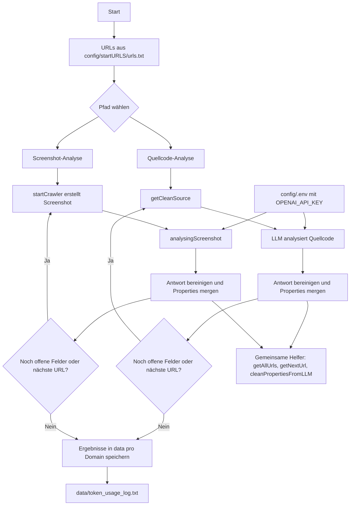

# Smart Web Scraper

Der Smart Web Scraper extrahiert strukturierte Informationen von Webseiten mit LLM-Unterstützung. Das Projekt ist jetzt in eine klarere Struktur aufgeteilt:

- `src/source-scraper/` für die Quellcode-Analyse
- `src/screenshot-scraper/` für die Screenshot-Analyse
- `config/` für JSON, Prompts und Env-Konfiguration
- `data/` nur für Ergebnisse und Logs

## Komplettablauf



## Voraussetzungen

- Node.js 18 oder neuer
- Git
- Ein OpenAI API Key als Umgebungsvariable `OPENAI_API_KEY`

## Installation

1. Repository klonen.
2. In den Ordner `Cheerio` wechseln.
3. Abhängigkeiten installieren:

   ```bash
   npm install
   ```

4. Lokale Konfiguration anlegen:
   - `config/.env.example` nach `config/.env` kopieren oder eine eigene `.env` im Projekt anlegen
   - `OPENAI_API_KEY` setzen

## Wichtige Konfigurationsdateien

- `config/startURLS/urls.txt`: Start-URLs, eine pro Zeile, ohne Leerzeilen
- `config/jsonRef.json`: Zielstruktur für die Quellcode-Analyse
- `config/jsonRefScreenshot.json`: Zielstruktur für die Screenshot-Analyse
- `config/prompts/source/instructionsPropmt.txt`: Systemprompt für die Quellcode-Analyse
- `config/prompts/screenshot/instruct.txt`: Systemprompt für die Screenshot-Analyse
- `config/jsonPrompt.json`, `config/jsonLeer.json`, `config/jsonFineTuning.jsonl`, `config/llamJSON.json`: weitere Vorlagen und Trainingsdaten
- `data/token_usage_log.txt`: Token-Protokoll

## Quellcode-Analyse starten

```bash
node src/source-scraper/index.js
```

Der Ablauf liest `OPENAI_API_KEY` aus der Umgebung. Die frühere Datei `apiKey.txt` wird nicht mehr verwendet.

## Screenshot-Analyse starten

```bash
node src/screenshot-scraper/index.js
```

## Verzeichnisse im Projekt

- `logic/`: Hilfsskripte für LLM-Anfragen und Quellcode-Reinigung
- `llama3/`: lokale Llama3-Anbindung
- `my-crawler/`: Screenshot-Crawler-Komponenten
- `data/`: Ergebnisse der Scrapes
- `config/`: Eingaben und Prompts

## Hinweis

Wenn du mit neuen Datenquellen arbeitest, zuerst die Start-URLs in `config/startURLS/urls.txt` pflegen und danach die passenden Felder in `config/jsonRef.json` anpassen.